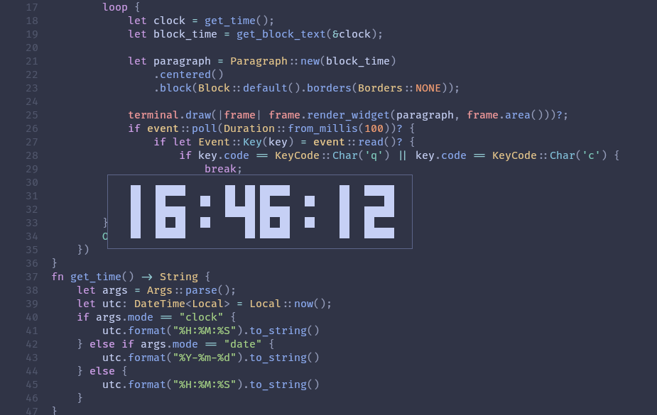

# clock.rs

clock.rs is a tui clock coded in rust with use of ratatui.



## Installation

You can build it from source or use aur helper by installing clock.rs-git package.

```bash
paru -S clock.rs-git
```

## Usage

Simply run the executable:
```bash
clock.rs
```
To display the date instead of the time:
```bash
clock.rs -m date
```
To display seconds:
```bash
clock.rs -s
```


[MIT](https://choosealicense.com/licenses/mit/)
